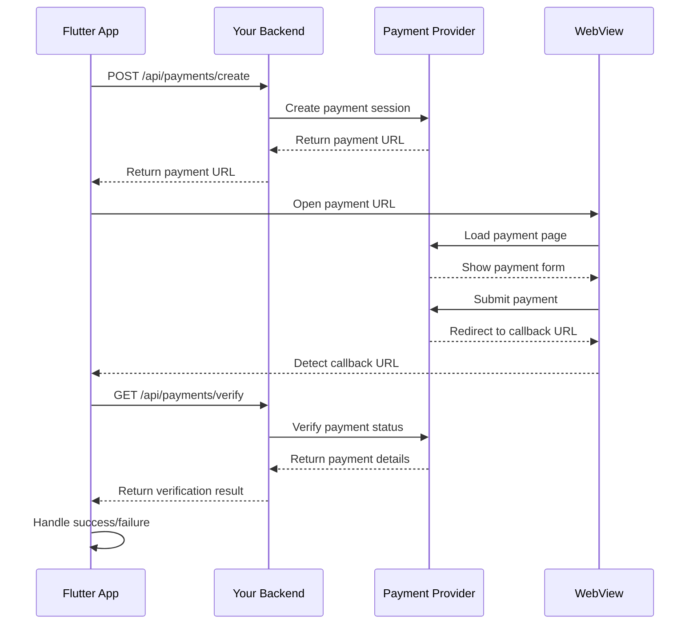

## unified_payment

A Flutter package that provides a unified API for multiple payment providers using a WebView-first approach.

### 🚀 Features

- **Multiple Payment Providers**: Stripe, PayPal, RazorPay, Paystack, Flutterwave
- **Unified API**: Switch providers with minimal code changes
- **WebView Integration**: Secure payment flows using WebView
- **Backend-First Security**: No secret keys in Flutter app
- **Standardized Responses**: Consistent payment responses across all providers
- **Environment Support**: Sandbox and live environments
- **Comprehensive Error Handling**: Detailed error messages and status codes
- **Easy Integration**: Simple setup and intuitive API

### 📱 Supported Payment Providers

| Provider | Status | Supported Features |
|----------|--------|-------------------|
| ✅ Stripe | Ready | Cards, Apple Pay, Google Pay, 3D Secure |
| ✅ PayPal | Ready | PayPal account, Cards via PayPal |
| ✅ RazorPay | Ready | Cards, UPI, Net Banking, Wallets |
| ✅ Paystack | Ready | Cards, Bank Transfer, USSD |
| 🔄 Flutterwave | Coming Soon | Cards, Bank Transfer, Mobile Money |

### 🔧 Installation

Add this to your package's `pubspec.yaml` file:

```yaml
dependencies:
  unified_payment: ^1.0.0
```

Run:

```bash
flutter pub get
```

### 🚦 Quick Start

#### 1. Initialize the Payment Service

```dart
import 'package:unified_payment/unified_payment.dart';

// Initialize with your preferred provider
await PaymentService().init(PaymentConfig(
  provider: PaymentProvider.stripe,
  apiKey: 'pk_test_...', // Your publishable key
  environment: PaymentEnvironment.sandbox,
  backendUrl: 'https://your-backend.com/api',
));
```

#### 2. Create a Payment Request

```dart
final request = PaymentRequest(
  amount: 29.99,
  currency: 'USD',
  description: 'Premium subscription',
  orderId: 'order_${DateTime.now().millisecondsSinceEpoch}',
  customerEmail: 'user@example.com',
  customerName: 'John Doe',
);
```

#### 3. Process the Payment

```dart
await PaymentService().pay(
  context: context,
  request: request,
  onSuccess: (PaymentResponse response) {
    print('Payment successful: ${response.transactionId}');
    // Navigate to success page, update UI, etc.
  },
  onFailure: (PaymentResponse response) {
    print('Payment failed: ${response.message}');
    // Show error message, offer retry, etc.
  },
);
```

### 🔄 Switching Payment Providers

Switching providers is as simple as changing the configuration:

```dart
// Switch to PayPal
await PaymentService().init(PaymentConfig(
  provider: PaymentProvider.paypal,
  apiKey: 'your-paypal-client-id',
  environment: PaymentEnvironment.sandbox,
  backendUrl: 'https://your-backend.com/api',
));

// Switch to RazorPay
await PaymentService().init(PaymentConfig(
  provider: PaymentProvider.razorpay,
  apiKey: 'rzp_test_...',
  environment: PaymentEnvironment.sandbox,
  backendUrl: 'https://your-backend.com/api',
));

// Same payment code works with any provider!
await PaymentService().pay(context: context, request: request, ...);
```

### 🏗️ Backend Setup

Your backend needs to provide two endpoints:

#### Create Payment Endpoint
```
POST /api/payments/create
```

**Request:**
```json
{
  "provider": "stripe",
  "amount": 2999,
  "currency": "USD",
  "description": "Premium subscription",
  "order_id": "order_123",
  "customer_email": "user@example.com",
  "api_key": "pk_test_...",
  "environment": "sandbox"
}
```

**Response:**
```json
{
  "payment_url": "https://checkout.stripe.com/pay/cs_...",
  "client_secret": "pi_123_secret_456",
  "transaction_id": "pi_123456789"
}
```

#### Verify Payment Endpoint
```
GET /api/payments/verify/{transactionId}
```

**Response:**
```json
{
  "status": "success",
  "transaction_id": "pi_123456789",
  "order_id": "order_123",
  "amount": 2999,
  "currency": "USD"
}
```

📚 **Detailed backend implementation examples** are available in the [Backend Integration Guide](BACKEND.md).

### 📖 Documentation

- [📋 API Reference](API.md) - Complete API documentation
- [🔧 Backend Integration Guide](BACKEND.md) - Backend setup and examples
- [📱 Example App](example/) - Complete working example
- [🔐 Security Best Practices](#security) - Security recommendations

### 🛡️ Security

This package follows security best practices:

- ✅ **No Secret Keys in Flutter**: Only public/publishable keys are used in the app
- ✅ **Backend Verification**: All payments are verified server-side
- ✅ **HTTPS Only**: All communications use secure connections
- ✅ **Webhook Support**: Reliable payment status updates via webhooks
- ✅ **Input Validation**: Comprehensive request validation and sanitization

### 🧪 Testing

#### Provider Test Credentials

**Stripe:**
- Success: `4242424242424242`
- Decline: `4000000000000002`

**PayPal:**
- Use PayPal sandbox buyer accounts

**RazorPay:**
- Success: `4111111111111111`
- Failure: `4000300011112220`

**Paystack:**
- Success: `4084084084084081`
- Insufficient funds: `5060666666666666666`

### 📋 Payment Flow



### 🔧 Advanced Usage

#### Custom WebView Implementation

```dart
final urlResponse = await PaymentService().createPaymentUrl(request);

Navigator.push(context, MaterialPageRoute(
  builder: (context) => PaymentWebView(
    paymentUrl: urlResponse.paymentUrl,
    provider: PaymentProvider.stripe,
    orderId: request.orderId,
    timeout: Duration(minutes: 10),
    loadingWidget: CustomLoadingWidget(),
    errorWidgetBuilder: (error) => CustomErrorWidget(error),
    onSuccess: (response) {
      // Custom success handling
    },
    onFailure: (response) {
      // Custom failure handling
    },
  ),
));
```

#### Manual Payment Verification

```dart
try {
  final response = await PaymentService().verifyPayment('txn_123456789');
  if (response.isSuccess) {
    print('Payment verified: ${response.transactionId}');
  } else {
    print('Payment verification failed: ${response.message}');
  }
} catch (e) {
  print('Verification error: $e');
}
```

#### Provider-Specific Features

```dart
// Get current provider type
final provider = PaymentService().providerType;

// Get provider-specific URL patterns
final patterns = PaymentService().getProviderUrlPatterns();

// Parse provider response
final response = PaymentService().parsePaymentResponse(providerData);
```

### 🤝 Contributing

We welcome contributions! Please see our [Contributing Guide](CONTRIBUTING.md) for details.

### 📄 License

This project is licensed under the MIT License - see the [LICENSE](LICENSE) file for details.

### 🆘 Support

- 📧 **Email**: support@unifiedpayment.dev
- 💬 **Issues**: [GitHub Issues](https://github.com/yourusername/unified_payment/issues)
- 📚 **Documentation**: [API Docs](API.md)
- 💻 **Example**: [Example App](example/)

### 🚀 Roadmap

- [ ] Flutterwave provider implementation
- [ ] Apple Pay integration for iOS
- [ ] Google Pay integration for Android
- [ ] Subscription payment support
- [ ] Multi-party payments
- [ ] Offline payment methods
- [ ] Payment analytics dashboard

### ⭐ Show Your Support

If this package helped you, please give it a ⭐ on GitHub and share it with others!

---

Made with ❤️ by the Flutter community